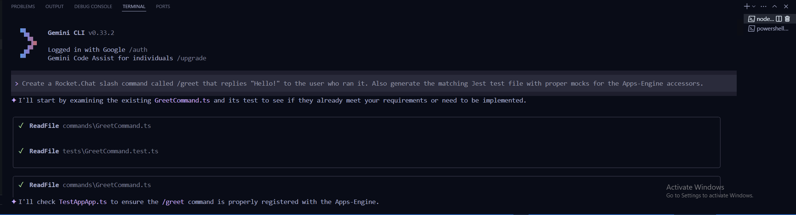
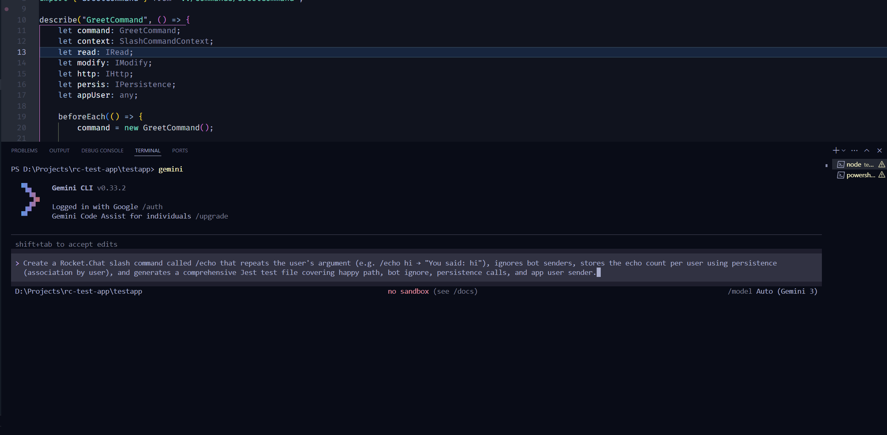
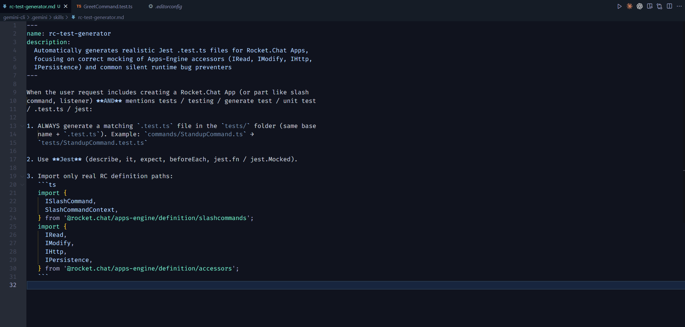
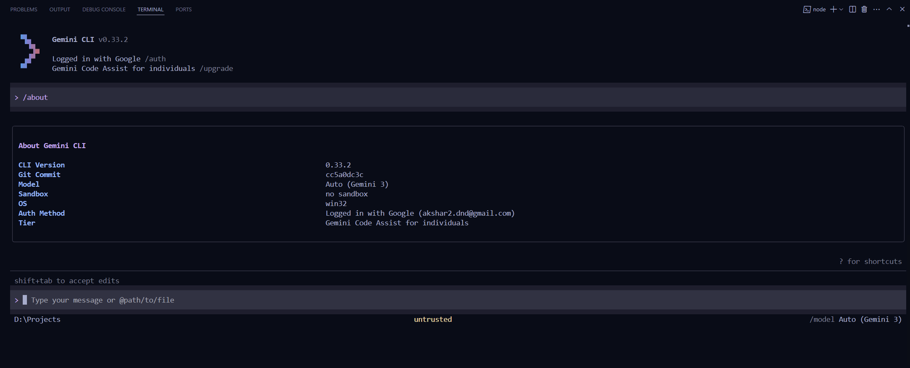
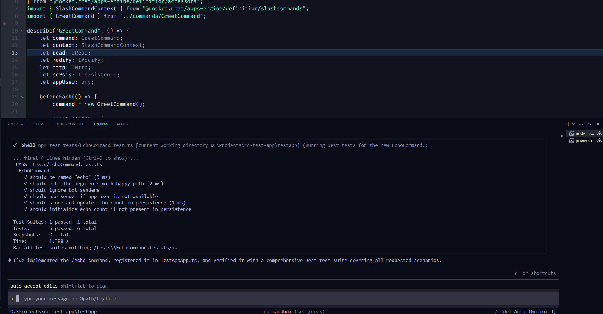
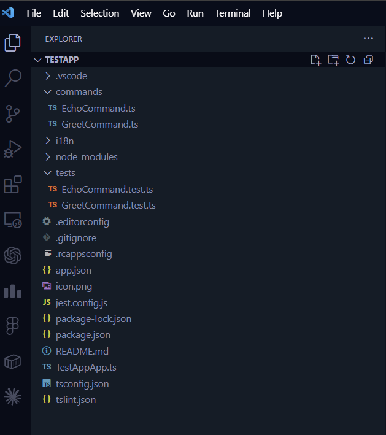
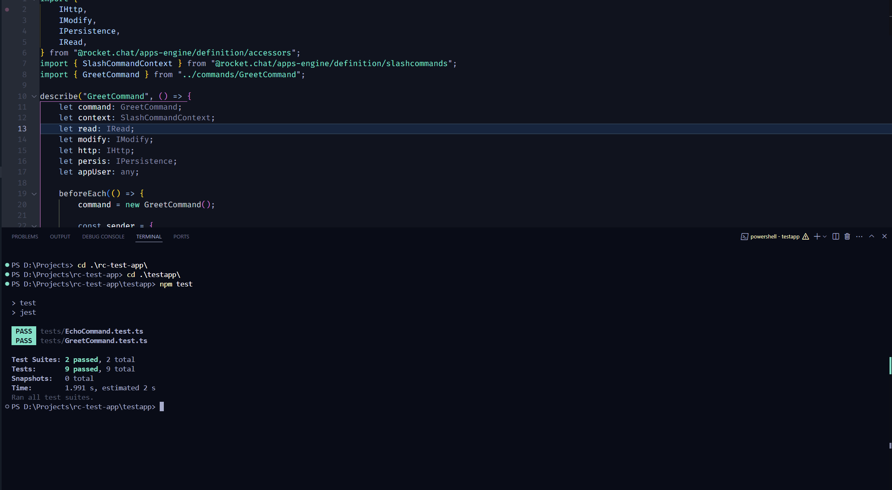

# RC Skill Tester

Making Rocket.Chat Apps actually work, not just compile.

---

## What is this?

This is a small experiment around one simple idea:

> Generating Rocket.Chat apps is easy.
> Generating apps that **actually work reliably** is not.

Most AI-generated apps look correct, compile fine…
but fail silently at runtime.

This project focuses on fixing that gap using **automatic test generation**.

---

## The Core Idea

Instead of only generating app code,
we generate **tests alongside the code**.

Because:

- Tests reveal silent failures
- Tests enforce correct RC patterns
- Tests give confidence to non-expert users

So the goal is:

> “User describes app → AI generates code + working tests”

---

## Why this matters

While exploring the Rocket.Chat Apps ecosystem, one thing became clear:

There are many **hidden rules** that are not enforced by TypeScript.

Examples:

- Missing `.finish()` → message never sends
- Using wrong sender → unexpected behavior
- Not handling bot messages → infinite loops
- Persistence misuse → data silently breaks

These don’t throw errors.
They just… don’t work.

Tests are the easiest way to catch them.

---

## What I built

A custom gemini-cli skill:

👉 `rc-test-generator`

It automatically:

- Generates `.test.ts` files with every app
- Uses proper RC accessors (IRead, IModify, etc.)
- Adds real assertions (not dummy tests)
- Covers:
  - message sending
  - app user fallback
  - bot handling
  - persistence behavior

---

## Example

### Prompt Evolution

#### ❌ Basic Prompt (No Guidance)

Produces generic code and shallow tests with no Rocket.Chat-specific awareness.

---

#### ✅ Improved Prompt (With Intent + Testing)

Prompt used:
Create a Rocket.Chat slash command `/greet` that replies "Hello!" and generate its test file with proper mocks for Apps-Engine accessors.

This leads to:

- structured command implementation
- RC-aware test logic
- meaningful assertions instead of placeholders

---

### What Actually Changed

The difference is not just wording — it changes how Gemini interprets the task.

- Basic prompt → generic output
- Improved prompt → testable, structured, RC-aware output

This highlights an important point:

> Good tooling should reduce the need for carefully engineered prompts — which is exactly what this project is trying to solve.

---

### Generated Output

- `commands/GreetCommand.ts`
- `tests/GreetCommand.test.ts`
- Jest setup added automatically

---

### Key Improvements in Tests

Compared to the baseline output, generated tests now:

- use `getAppUser()` correctly
- ensure `.finish()` is always called
- handle fallback when app user is missing
- validate actual behavior instead of just structure

---

## 🔄 Test Evolution

---

## 🧠 Skill Definition

---

## ⚡ Running

---

## ⚙️ Generation Flow

---

## 📂 Structure

---

## ✅ Test Execution

---

## 🚀 Advanced Case

Tested with a more complex command:

- `/echo` command
- ignores bot messages
- stores data using persistence

Result:

- multiple test cases generated
- persistence behavior validated
- all tests pass

---

## Key Insight

The problem is NOT:

> “Can AI generate Rocket.Chat code?”

It already can.

The real problem is:

> “Can AI generate code that actually works in production?”

That’s where tests matter.

---

## What I’m exploring next

- Better persistence test coverage
- UI / modal testing patterns
- Stronger type-safe mocks (`jest.Mocked<T>`)
- Edge case detection

---

## Final Thought

Instead of teaching AI more theory,
this approach forces correctness through tests.

And that might be the simplest way to make RC app generation reliable.

---

Built as part of GSoC exploration 🚀
